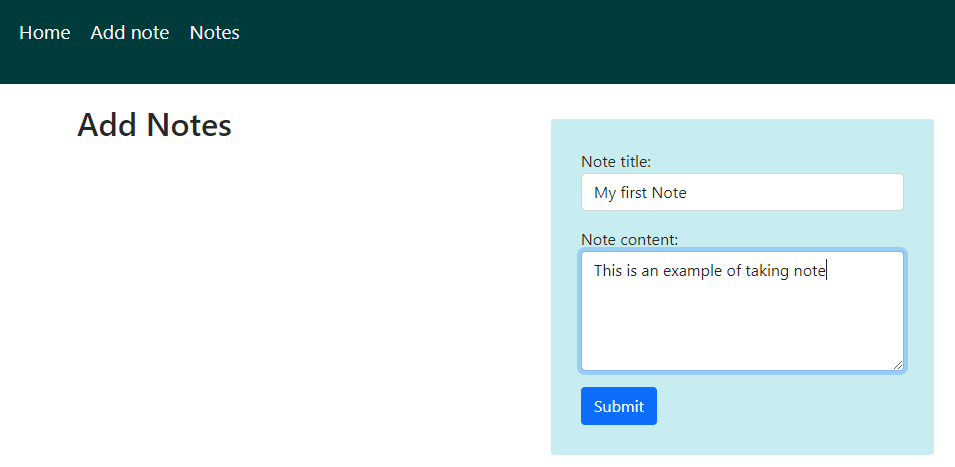
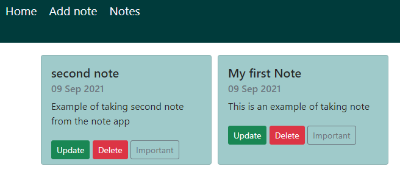

# Note Taking App
Note taking app build with HTML,CSS,JavaScript with Django framework on the backend to store notes in the database. \
User can create new note, update and delete the notes. User can also view their perviously stored notes on notes page.accordion-body
___
# Screenshots
#### Add notes

#### View Notes
